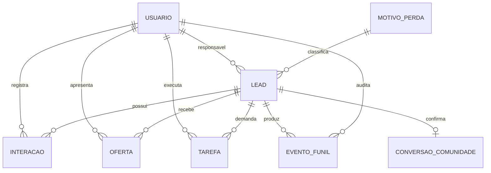

# Decisão determinística — pausa da identidade e início do sistema digital

> [!success] Conclusão determinada
> É adequado pausar a etapa de identidade visual no estado atual e iniciar o projeto do sistema que centralizará o ecossistema digital da Uli. A identidade aprovada já possui consistência suficiente para orientar uma interface inicial. Porém, ainda não é adequado iniciar a programação integral do software: antes é necessário definir o blueprint operacional e o MVP do sistema.

## Pergunta respondida

O projeto pode avançar da identidade visual para o desenvolvimento do sistema agora?

**Resposta:** sim, para a fase de descoberta, especificação e arquitetura; não, ainda, para construir o sistema completo sem uma definição operacional anterior.

## Evidências diretas da base de conhecimento

- O [[Briefing Estratégico - Personalidade e Percepção da Marca]] já define o público prioritário: profissionais e empresários experientes.
- O posicionamento, a transformação central e o método estão definidos para uma mentoria única aplicável a carreira e negócios.
- O método está organizado nas dimensões **SER, PENSAR, FALAR, AGIR e RECEBER**.
- A [[Landing Page - Aula Estratégica Entre Potencial e Resultado]] já define uma porta de entrada demonstrativa para o ecossistema: aula estratégica, diagnóstico do bloqueio e próximo movimento.
- A landing atual foi deliberadamente construída sem captação real, banco de dados, CRM, autenticação ou persistência; portanto, ela não constitui ainda um sistema operacional.
- A direção visual A1 + B1 + T1 + F1, a paleta técnica e as regras de uso v1 estão aprovadas e implementadas.
- O monograma institucional e o brandbook técnico completo continuam pendentes, mas essas pendências não impedem a definição da arquitetura funcional do produto.
- O repositório atual contém páginas e ativos estáticos; não há aplicação, backend, banco, autenticação, API ou modelo de dados já definido.

## Inferência estratégica

A identidade visual deixou de ser o bloqueio principal. O risco determinante agora é iniciar um software sem saber exatamente qual operação ele deve centralizar.

O sistema não deve ser definido como uma tecnologia isolada ou como um painel genérico. Ele precisa representar o fluxo real do negócio digital da Uli: atração, diagnóstico, relacionamento, venda, onboarding, entrega da mentoria, acompanhamento e evolução do cliente.

Como esses fluxos ainda não foram especificados com usuários, estados, responsabilidades, dados, integrações e critérios de sucesso, escolher agora Node.js, um framework ou uma arquitetura definitiva seria uma decisão técnica prematura.

## O que está liberado agora

1. Pausar o refinamento do selo institucional e a consolidação final do brandbook.
2. Iniciar a descoberta operacional do ecossistema digital.
3. Criar a especificação do produto e do MVP.
4. Mapear jornadas, processos, entidades, permissões e integrações.
5. Criar wireframes funcionais usando os tokens visuais aprovados.
6. Escolher a tecnologia somente depois que os requisitos do MVP estiverem definidos.

## O que não está liberado ainda

- Construir um sistema completo com módulos inventados.
- Escolher Node.js ou outro framework sem requisitos de escala, integrações e operação.
- Criar banco de dados com informações reais sem política de privacidade, consentimento, retenção e acesso.
- Tratar a landing demonstrativa como funil validado ou como fonte de dados reais.
- Criar uma plataforma de cursos, CRM, comunidade, checkout ou área de membros sem confirmar o papel de cada módulo no modelo de negócio.

## Próximo avanço determinístico

Criar a **Especificação do MVP do Sistema do Ecossistema Digital da Uli**, contendo, nesta ordem:

1. objetivo operacional único do sistema;
2. usuários e papéis: Uli, equipe, lead, cliente e demais perfis comprovadamente necessários;
3. jornada completa desde a entrada até a entrega e acompanhamento;
4. processos, estados e eventos de cada etapa;
5. módulos indispensáveis e funcionalidades explicitamente fora do MVP;
6. entidades e dados necessários, sem dados pessoais reais;
7. regras de acesso, privacidade, consentimento, auditoria, backup e segurança;
8. integrações necessárias com formulário, comunicação, agenda, pagamento e gestão comercial, somente se justificadas;
9. wireframes funcionais prioritários;
10. critérios de aceite e decisão tecnológica.

## Decisão de prioridade

O próximo trabalho do projeto não é finalizar o selo nem iniciar diretamente o código do software. É produzir o blueprint operacional do MVP. Depois da aprovação desse blueprint, a implementação poderá começar de forma determinística, com uma arquitetura técnica proporcional ao negócio e sem retrabalho causado por módulos indefinidos.

## Relações

- [[Briefing Estratégico - Personalidade e Percepção da Marca]]
- [[Landing Page - Aula Estratégica Entre Potencial e Resultado]]
- [[Direção Visual Preliminar - A1 T1 M2 F1]]
- [[Regras de Uso do Sistema Visual - A1 B1 F1]]
- [[Paleta Técnica Definitiva - A1]]

## Próximo avanço após esta confirmação

Definir as telas e os fluxos operacionais do CRM do MVP: autenticação, painel, cadastro de lead, detalhe do lead, pipeline, tarefas e registro de oferta.

### Tela inicial do sistema

A primeira tela após a autenticação será **Visão Geral**. Ela não abrirá diretamente no pipeline.

O objetivo da tela é apresentar uma visão geral do CRM e os indicadores da operação comercial referentes ao dia atual. O pipeline continuará sendo uma tela própria, acessível pela navegação principal.

#### Estrutura determinada da Visão Geral

- resumo do CRM;
- indicadores comerciais de hoje;
- leitura rápida da movimentação dos leads;
- acesso direto ao pipeline e às ações operacionais necessárias.

Os indicadores, fórmulas, filtros e estados vazios serão definidos no mapa funcional antes da implementação. A tela deverá usar a identidade A1/B1/T1/F1: marrom profundo e marfim como base, champagne e terracota apenas como acentos, Libre Baskerville para títulos e Source Sans 3 para interface e dados.

#### Indicadores básicos de hoje

A primeira versão da Visão Geral exibirá somente indicadores diretamente derivados do CRM e dos eventos do dia atual:

| Indicador | Definição da primeira versão |
| --- | --- |
| **Novos leads hoje** | Quantidade de leads criados desde 00:00 até o momento atual. |
| **Leads em qualificação** | Quantidade de leads cujo estado atual é **Qualificando**. |
| **Ofertas apresentadas hoje** | Quantidade de registros de oferta criados no dia atual. |
| **Ganhos hoje** | Quantidade de conversões para **Ganho** registradas no dia atual. |
| **Perdidos hoje** | Quantidade de transições para **Perdido** registradas no dia atual. |
| **Tarefas pendentes hoje** | Quantidade de tarefas vencidas ou com prazo para o dia atual e ainda não concluídas. |

Regras da primeira versão:

- Os indicadores respeitarão o fuso horário configurado para a operação.
- O período padrão será o dia atual, sem comparação automática com períodos anteriores.
- Cada indicador deverá permitir acesso ao recorte correspondente do CRM quando essa navegação estiver disponível.
- Estados vazios serão exibidos como `0`, sem dados fictícios.
- Não serão incluídos inicialmente ticket médio, taxa de conversão, previsão de receita, gráficos avançados ou metas; essas métricas dependerão de dados suficientes e uso prático do sistema.
- A lista poderá ser aprimorada após a operação real produzir evidências de quais indicadores apoiam decisões comerciais.

## Limite desta decisão

Esta nota autoriza o início da fase de descoberta e arquitetura do sistema. Ela não aprova ainda uma stack, um framework, uma integração, um banco de dados, uma contratação de serviço ou uma publicação de aplicação funcional.

## Decisões de descoberta registradas posteriormente

### Núcleo do MVP

O MVP será um sistema próprio para centralizar a operação comercial do negócio digital da Uli: cadastro de leads, CRM, funil de vendas, histórico de relacionamento e acompanhamento de oportunidades.

A entrega da mentoria permanecerá inicialmente em uma área de membros de plataformas de pagamento, como Hotmart, Kiwify ou Hubla. Central de conteúdo, materiais de endomarketing e outras extensões ficarão para fases posteriores.

### Entrada de leads

As primeiras origens determinadas são:

- formulário da página de vendas ou landing page, com nome, e-mail e telefone, registro no Supabase e redirecionamento para o grupo da oferta no WhatsApp;
- botões de WhatsApp nas páginas, com registro de clique, campanha e origem; a identificação automática do contato dependerá da integração oficial, prevista para a última fase;
- redes sociais, especialmente Instagram, como integração posterior por sua maior complexidade de API, permissões e consentimento.

Até as integrações oficiais, contatos de WhatsApp e redes sociais poderão entrar por cadastro manual ou importação de planilhas.

### Funil comercial do MVP

O pipeline terá exatamente cinco estados:

1. **Novo** — lead recém-cadastrado, ainda sem qualificação concluída;
2. **Qualificando** — contato em análise ou em conversa para entender contexto, momento e aderência;
3. **Oferta** — oferta ou próximo passo comercial apresentado;
4. **Ganho** — oportunidade convertida em cliente;
5. **Perdido** — oportunidade encerrada sem conversão ou sem continuidade.

Não será criado um estado separado de negociação nesta primeira versão; a decisão comercial permanecerá dentro de **Oferta**.

### Automação determinística do estado do lead

O estado do lead será derivado automaticamente dos eventos válidos do relacionamento comercial. O usuário não deverá mover livremente o lead entre etapas quando houver um evento que determine o estado.

| Evento determinante | Novo estado | Regra |
| --- | --- | --- |
| Entrada de lead por formulário, WhatsApp, rede social, cadastro manual ou importação | **Novo** | Todo lead começa obrigatoriamente em **Novo**. |
| Primeira interação válida entre as partes | **Qualificando** | Uma interação válida é uma mensagem ou resposta com conteúdo suficiente para iniciar a análise do contexto, momento e aderência do lead. |
| Mensagem vaga, vazia, erro, resposta automática sem conteúdo ou interação inválida | **Novo** | Não avança o funil nem altera o estado atual. |
| Oferta apresentada ao lead | **Oferta** | O registro da oferta é o gatilho obrigatório para a mudança automática. |
| Lead entra na comunidade Vida Extraordinária | **Ganho** | A entrada confirmada na comunidade encerra a oportunidade como convertida. |
| Lead não entra na comunidade Vida Extraordinária | **Perdido** | O encerramento sem conversão exige motivo obrigatório antes de concluir a mudança. |

#### Regras de transição

1. Todo cadastro inicia em **Novo**, independentemente da origem.
2. A primeira mensagem ou resposta válida entre equipe e lead altera automaticamente o estado para **Qualificando**.
3. Mensagens vagas, vazias, erros, respostas automáticas sem conteúdo e interações inválidas não avançam o lead.
4. A apresentação de uma oferta altera automaticamente o estado para **Oferta**.
5. A confirmação de entrada na comunidade Vida Extraordinária altera o estado para **Ganho**.
6. Quando a oportunidade for encerrada sem entrada na comunidade, o estado poderá ser alterado para **Perdido** no MVP sem modal obrigatório.
7. O registro estruturado do motivo de perda fica no roadmap futuro e não bloqueará a transição nesta primeira entrega.
8. Cada mudança automática deverá preservar evento, data, usuário responsável, origem e estado anterior para auditoria.

#### Roadmap futuro — modal de perda

Em uma fase futura, ao selecionar ou acionar o encerramento como **Perdido**, o sistema deverá bloquear a conclusão e abrir um modal. O modal deverá exigir:

- motivo padronizado selecionado pelo usuário;
- observação complementar somente quando necessária;
- confirmação explícita do encerramento.

Essa funcionalidade não fará parte da primeira entrega do MVP. Quando for implementada, o sistema não deverá aceitar texto livre como único motivo, pois isso impediria a análise determinística das perdas.

#### Motivos padronizados aprovados

Quando implementado, o modal de encerramento como **Perdido** terá, inicialmente, somente as seguintes opções:

| Código | Motivo exibido | Observação |
| --- | --- | --- |
| `entrou-em-contato-por-engano` | **Entrou em contato por engano** | O contato informa ou demonstra que a entrada ocorreu equivocadamente. |
| `nao-tem-interesse` | **Não tem interesse** | O contato declara ausência de interesse na oferta ou continuidade. |

Quando implementado, o campo de motivo será obrigatório. A observação complementar poderá ser preenchida, mas não substituirá a seleção de uma das categorias aprovadas. Novos motivos somente poderão ser adicionados após evidência operacional e nova decisão registrada.

#### Fonte de verdade

O estado atual exibido no CRM deverá ser calculado a partir do último evento válido registrado no histórico do lead. Alterações manuais somente poderão existir como ação controlada, com permissão adequada, motivo e auditoria; elas não poderão apagar os eventos automáticos.

### Perfis de usuário e permissões do MVP

O MVP terá três perfis conceituais. Somente os dois primeiros terão acesso autenticado ao sistema.

| Perfil | Acesso e responsabilidades | Limite |
| --- | --- | --- |
| **Administradora** | Acesso total ao sistema, configurações, usuários, relatórios e CRM. | Responsável pela governança e pelas permissões da operação. |
| **Comercial** | Cadastro, qualificação, ofertas, tarefas e atualização de leads. | Não administra configurações globais nem usuários, salvo autorização futura explícita. |
| **Lead** | Não terá acesso ao sistema no MVP; participa apenas dos canais externos, como landing page, WhatsApp e comunidade. | Não haverá login, painel ou área autenticada de lead nesta fase. |

#### Regras de autorização

1. Toda operação autenticada deverá estar vinculada a um usuário com perfil **Administradora** ou **Comercial**.
2. A **Administradora** poderá consultar e operar todos os registros necessários ao CRM, além de gerenciar usuários e configurações.
3. O perfil **Comercial** poderá operar leads e oportunidades, registrar interações, tarefas e ofertas, respeitando o histórico de auditoria.
4. O perfil **Comercial** não poderá criar ou remover usuários, alterar configurações críticas ou apagar o histórico de um lead.
5. O **Lead** será uma entidade do CRM, não um perfil autenticado do sistema.
6. A autenticação, a recuperação de acesso, a expiração de sessão e a proteção contra acesso indevido serão requisitos técnicos do MVP.

### Modelo de dados do MVP comercial

O modelo de dados será orientado ao lead e ao histórico imutável de eventos. O estado atual do funil será uma projeção do último evento válido, e não a única fonte de informação.

#### Entidades e campos

| Entidade | Campos obrigatórios | Campos condicionais ou complementares |
| --- | --- | --- |
| **Lead** | `id`, `nome`, `telefone`, `origem`, `estado_atual`, `criado_em`, `atualizado_em` | `email`, `campanha`, `cidade`, `observacao`, `responsavel_id`, `ultimo_contato_em`, `perdido_motivo_id` (roadmap) |
| **Interação** | `id`, `lead_id`, `canal`, `tipo`, `validade`, `ocorreu_em`, `criado_por` | `resumo`, `referencia_externa`, `direcao`, `conteudo_restrito` |
| **Oferta** | `id`, `lead_id`, `nome`, `apresentada_em`, `apresentada_por`, `estado` | `valor_referencial`, `produto`, `observacao`, `decidida_em` |
| **Tarefa** | `id`, `lead_id`, `titulo`, `responsavel_id`, `status`, `criada_em` | `prazo_em`, `concluida_em`, `observacao`, `tipo` |
| **Evento do funil** | `id`, `lead_id`, `tipo_evento`, `estado_anterior`, `estado_novo`, `ocorreu_em`, `criado_por` | `origem`, `entidade_tipo`, `entidade_id`, `metadados` |
| **Motivo de perda** | `id`, `codigo`, `nome`, `ativo` | `descricao`, `ordem` |
| **Usuário** | `id`, `nome`, `email`, `perfil`, `ativo`, `criado_em` | `ultimo_acesso_em` |
| **Conversão na comunidade** | `id`, `lead_id`, `comunidade`, `confirmada_em`, `confirmada_por` | `referencia_externa`, `observacao` |

#### Regras de obrigatoriedade

1. `telefone` e `origem` são obrigatórios para todo lead; o e-mail é obrigatório quando a origem for formulário de página de vendas.
2. A origem deve ser um valor controlado, inicialmente: `landing_page`, `whatsapp`, `instagram`, `cadastro_manual` ou `importacao`.
3. O estado inicial de todo lead é `novo`.
4. Toda interação precisa identificar canal, tipo, validade, data e responsável ou fonte técnica.
5. Interações inválidas podem ser registradas para auditoria, mas não podem produzir transição no funil.
6. Toda oferta precisa registrar qual oferta foi apresentada, quando e por quem.
7. Toda tarefa precisa ter responsável e status; tarefas concluídas preservam a data de conclusão.
8. Um lead em `perdido` não exige `perdido_motivo_id` no MVP; o vínculo será obrigatório somente quando o modal de perda entrar no roadmap implementado.
9. Um lead em `ganho` exige registro de confirmação na comunidade Vida Extraordinária.
10. Eventos do funil são append-only no MVP: não podem ser apagados pelo perfil Comercial.

#### Relações

#### Integridade do histórico

- O histórico registra o estado anterior e o novo estado, mesmo quando a transição for automática.
- O estado atual do lead deve ser recalculável a partir dos eventos válidos.
- A exclusão física de leads, interações, ofertas, tarefas e eventos não faz parte do MVP; o sistema deverá usar desativação ou arquivamento controlado quando necessário.
- Dados pessoais devem ser minimizados, protegidos por controle de acesso e mantidos apenas enquanto houver finalidade operacional ou obrigação aplicável.
- Nenhum dado real será usado durante a fase de protótipo; testes usarão dados fictícios.
