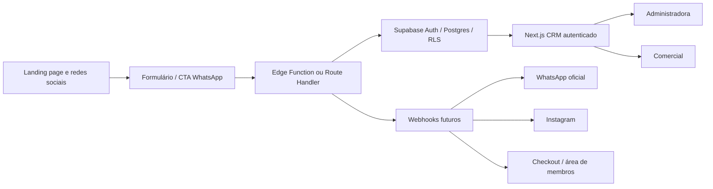

# Decisão técnica — arquitetura do CRM e do ecossistema digital

> [!success] Conclusão determinada
> O sistema será desenvolvido com **Next.js App Router + React + TypeScript** no frontend e na camada de aplicação, usando **Supabase** como backend gerenciado: PostgreSQL, Auth, Row Level Security, Storage e Edge Functions. A aplicação autenticada será hospedada como **Hostinger Node.js Web App conectado ao GitHub**, se esse recurso estiver disponível no plano atual; **Vercel** será o fallback. Não será criado um backend Node.js/Express separado no MVP.

## Por que esta é a escolha adequada

O MVP precisa de uma interface autenticada para Administradora e Comercial, dados relacionais de CRM, histórico append-only, regras de acesso por perfil, formulários de entrada e futuras integrações com WhatsApp, Instagram e plataformas de pagamento. A combinação escolhida cobre esses requisitos com uma arquitetura proporcional:

- Next.js concentra telas, navegação, renderização e endpoints pontuais;
- TypeScript reduz ambiguidades no modelo Lead/Event/Offer/Task e permite gerar tipos a partir do banco;
- Supabase fornece Postgres, autenticação e controle de acesso por RLS;
- Edge Functions recebem webhooks e executam integrações que não devem expor segredos ao navegador;
- Hostinger Node.js Web App fornece o runtime adequado se o plano atual oferecer o recurso; Vercel é o fallback compatível com Next.js.

## Stack oficial

| Camada | Tecnologia determinada | Uso no projeto |
| --- | --- | --- |
| Framework full-stack | **Next.js App Router** | Rotas, layouts, Server Components, Client Components e Route Handlers. |
| UI | **React** | Componentes da Visão Geral, Pipeline, Leads, Tarefas, Ofertas e Configurações. |
| Linguagem | **TypeScript** | Domínio, componentes, contratos de API, validações e testes. |
| Estilo | **CSS Modules + tokens CSS existentes** | Aplicar A1/B1/T1 sem substituir a identidade visual por um kit genérico. |
| Backend principal | **Supabase** | Postgres, Auth, RLS, Storage e serviços gerenciados. |
| Lógica de integração | **Supabase Edge Functions em TypeScript/Deno** | Webhooks, WhatsApp oficial, Instagram, formulários públicos e integrações com checkout. |
| Validação de entrada | **Zod** | Validar payloads de formulário, eventos, ofertas e webhooks antes de persistir. |
| Dados no cliente | **Supabase JS + TanStack Query** | Sessão, consultas, cache e invalidação no painel autenticado. |
| Testes | **Vitest + Testing Library + Playwright** | Regras puras, componentes e fluxos críticos autenticados. |
| Qualidade | **ESLint + Prettier + TypeScript strict** | Padronização e bloqueio de erros evitáveis. |
| Hospedagem do sistema | **Hostinger Node.js Web App + GitHub**, se disponível no plano atual; Vercel como fallback | Runtime dinâmico do Next.js e deploy automático a partir da `main`. |
| Hospedagem estática atual | **Hostinger via FTP** | Landing, identidade visual, brandbook e protótipo estático enquanto permanecerem estáticos. |

## Backend: o que será e o que não será

### Será utilizado

- PostgreSQL do Supabase como fonte de verdade;
- Supabase Auth para usuários autenticados;
- RLS para separar o que Administradora e Comercial podem consultar ou alterar;
- tabelas de `leads`, `interactions`, `offers`, `tasks`, `funnel_events`, `community_conversions` e `profiles`;
- Edge Functions para receber webhooks e operar com chaves secretas;
- Route Handlers do Next.js somente para BFF, webhooks controlados ou operações que precisem combinar autenticação e dados.

### Não será utilizado no MVP

- backend Node.js/Express separado;
- servidor VPS próprio;
- ORM obrigatório antes de validar o schema do Supabase;
- microserviços;
- Redis, filas ou workers dedicados;
- Kubernetes;
- integração automática com Instagram antes de permissões e necessidade comprovada;
- área de membros própria.

Node.js continuará sendo o runtime de desenvolvimento e ferramentas do projeto, mas não será uma API Express independente. O Next.js já oferece Route Handlers quando houver necessidade de uma camada de servidor específica.

## Arquitetura de alto nível

## Regra de segurança

O navegador poderá usar somente a chave pública do Supabase, sempre com RLS ativo e políticas de menor privilégio. Chaves secretas, service role e credenciais de integrações existirão somente em variáveis de ambiente de servidor ou secrets das Edge Functions. Nunca serão gravadas no repositório, no frontend, no cofre ou em mensagens.

## Ordem de implementação

1. Criar o aplicativo Next.js em uma área própria do repositório, sem substituir as páginas estáticas existentes.
2. Migrar os tokens A1/B1/T1 e a casca visual do protótipo estático para componentes reutilizáveis.
3. Definir migrations SQL do Supabase para perfis, leads, eventos, ofertas, tarefas e conversões.
4. Configurar Auth e RLS para Administradora e Comercial.
5. Implementar o cadastro real de lead da landing page.
6. Implementar Visão Geral, Leads, Pipeline, detalhe, tarefas e ofertas com dados reais.
7. Implementar as transições determinísticas do funil dentro de transações/eventos auditáveis.
8. Adicionar Edge Functions para webhooks e integrações externas somente quando cada contrato estiver definido.

## Decisão de hospedagem

O protótipo atual continua em `https://crm.ulizarzana.com/` como demonstração estática até a aplicação real estar validada. A aplicação real deverá ocupar esse mesmo subdomínio em uma instalação Node.js Web App separada, sem substituir os arquivos estáticos da raiz. A primeira implementação de deploy será a integração GitHub nativa da Hostinger, caso o plano atual ofereça Node.js Web Apps; se essa capacidade não estiver disponível, o mesmo projeto será conectado à Vercel e o DNS do subdomínio será apontado para ela. A raiz `https://ulizarzana.com/` e as áreas estáticas existentes permanecem na Hostinger.

## Migração segura e condição de execução

1. Manter o site estático atual e o protótipo do CRM intactos como rollback.
2. Criar o projeto Next.js em diretório próprio do repositório, sem misturá-lo com `web/`.
3. Validar no hPanel se o plano possui **Node.js Web App** e conexão GitHub.
4. Criar uma aplicação separada vinculada a `crm.ulizarzana.com`, com build e start do Next.js.
5. Fazer deploy de teste e validar a aplicação em URL temporária.
6. Só depois apontar o subdomínio para o novo runtime.
7. Preservar a raiz e as rotas `/identidade-visual/` e `/brandbook/`.
8. Remover o protótipo estático do subdomínio somente após o novo app responder em produção e após confirmar rollback.

Na verificação autenticada do hPanel em 13/08/2026, o recurso **Implante web app / Node.js** estava visível, porém bloqueado: o plano Premium atingiu o limite de 5 Web Apps Node.js. O hPanel ofereceu upgrade para Cloud. Nenhum upgrade foi contratado, nenhum aplicativo foi removido e nenhum arquivo publicado foi apagado ou sobrescrito.

Enquanto o limite persistir, a alternativa operacional é o workflow `deploy-crm-static.yml`, que publica somente `web/crm/` por FTP na porta 21, no diretório remoto `crm/`, usando secrets do GitHub Actions. O app Next.js permanece versionado em `apps/crm-next/` e pronto para futura migração quando houver vaga Node.js ou infraestrutura compatível.

## Resultado da publicação automática — 13/08/2026

- Secrets `CRM_FTP_SERVER`, `CRM_FTP_USERNAME` e `CRM_FTP_PASSWORD` foram configurados no repositório como secrets protegidos do GitHub Actions; os valores não foram versionados nem registrados no cofre.
- A primeira execução falhou antes da conexão por configuração do arquivo de estado; o workflow foi corrigido para usar `.ftp-state-crm.json`.
- A segunda execução concluiu com sucesso: workflow `Deploy CRM static`, run `31740953463`.
- Verificação pública posterior: `https://crm.ulizarzana.com/` retornou HTTP 200.
- Verificação de preservação: `https://ulizarzana.com/`, `/identidade-visual/` e `/brandbook/` retornaram HTTP 200.

## Estado desta execução — scaffold Next.js

- Criado o projeto isolado `apps/crm-next/` com Next.js 16.3.0, React 19.2.8, TypeScript strict e Node 22.
- Criada a primeira Visão Geral local com dados fictícios, seis indicadores e os cinco estados do funil.
- Criado `.env.example` sem valores reais.
- Testes locais do scaffold e da Visão Geral: 4 testes aprovados.
- Build de produção Next.js: aprovado.
- Nenhum arquivo em `web/`, nenhuma página estática publicada e nenhum registro DNS foi alterado.
- O deploy Node.js permanece pendente de capacidade no plano; a publicação automática estática por GitHub Actions/FTPS é o fallback vigente. Vercel permanece alternativa futura de runtime.

## Critério para reconsiderar a arquitetura

A arquitetura só deverá ser revista se surgirem requisitos comprovados que o conjunto Next.js + Supabase não atenda, como processamento assíncrono pesado, volume elevado de mensagens, necessidade de workers persistentes ou integrações que exijam infraestrutura própria. Até que esses sinais apareçam, adicionar um backend Node/Express separado aumentaria complexidade sem resolver uma necessidade do MVP.

## Fontes técnicas

- [Next.js App Router](https://nextjs.org/docs/app)
- [Next.js Route Handlers](https://nextjs.org/docs/app/getting-started/route-handlers)
- [Supabase Database](https://supabase.com/docs/guides/database/overview)
- [Supabase Row Level Security](https://supabase.com/docs/guides/database/postgres/row-level-security)
- [Supabase Edge Functions](https://supabase.com/docs/guides/functions)
