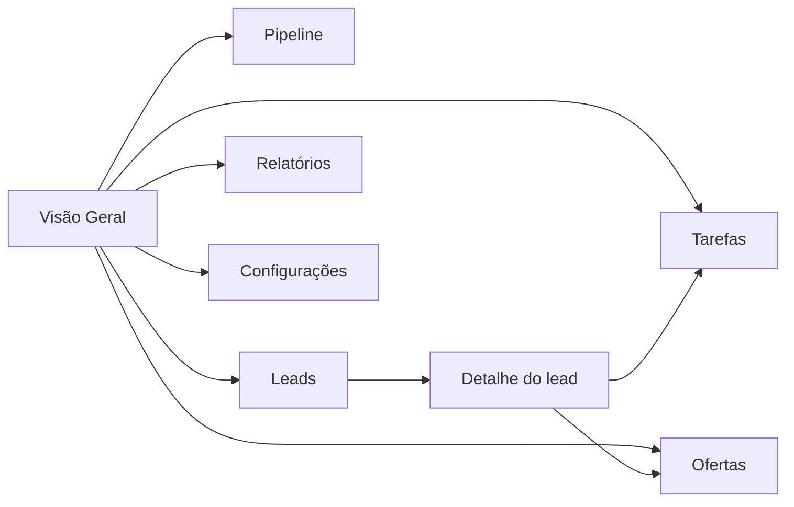

# Mapa funcional e layout do CRM MVP

## Decisão de produto

O primeiro sistema do ecossistema digital da Uli será um núcleo próprio de operação comercial. Ele centraliza leads, origem, estado do funil, histórico de relacionamento, ofertas e tarefas. A entrega da mentoria continua em plataforma de área de membros; conteúdo, endomarketing e integrações avançadas permanecem fora desta primeira fatia.

O protótipo é estático, navegável e usa somente dados fictícios. Ele não autentica usuários, não chama Supabase, não envia mensagens e não persiste alterações. Essas limitações são intencionais: a interface valida o modelo operacional antes da conexão com dados reais.

## Direção visual aplicada

- Base A1 / Autoridade Clássica, assinatura B1 e tipografia T1.
- `Libre Baskerville` para títulos e momentos de orientação.
- `Source Sans 3` para navegação, dados, formulários e ações.
- Marrom profundo e marfim como base; champagne e terracota somente para hierarquia, estados e ação.
- Selo institucional permanece fora do escopo desta etapa e não é usado como dependência funcional.
- A interface deve comunicar leitura executiva, clareza e decisão sem aparência de ferramenta técnica genérica.

## Arquitetura de navegação

### Rotas do protótipo

| Hash | Tela | Função principal |
| --- | --- | --- |
| `#visao-geral` ou vazio | Visão Geral | Ler a operação comercial de hoje e escolher o próximo movimento. |
| `#pipeline` | Pipeline | Enxergar oportunidades agrupadas nos cinco estados determinados. |
| `#leads` | Leads | Pesquisar, filtrar e abrir contatos. |
| `#leads/{id}` | Detalhe do lead | Consultar dados, estado atual, responsável e histórico. |
| `#tarefas` | Tarefas | Organizar ações pendentes da operação. |
| `#ofertas` | Ofertas | Consultar ofertas apresentadas e seu momento comercial. |
| `#relatorios` | Relatórios | Ler distribuição por estado e origem sem métricas prematuras. |
| `#configuracoes` | Configurações | Exibir governança, perfis e integrações futuras. |

## Layout funcional determinado

### Casca do sistema

- Desktop: barra lateral fixa de 248 px; topo de 76 px; conteúdo com largura máxima de 1.480 px.
- Barra lateral: marca UZ textual provisória, nome da operação, navegação principal e perfil atual.
- Topo: breadcrumb, aviso explícito de protótipo e identificação do usuário.
- Mobile: barra lateral transformada em menu drawer; conteúdo ocupa toda a largura com margens de 20 px.
- Acessibilidade: foco visível, navegação por teclado, títulos semânticos, tabelas com cabeçalho e estados comunicados por texto.

### Visão Geral — tela inicial

1. Cabeçalho com contexto “Operação comercial · hoje”, data fictícia do protótipo e ação de novo lead.
2. Seis indicadores básicos:
   - Novos leads hoje: leads criados desde 00:00.
   - Leads em qualificação: estado atual `qualificando`.
   - Ofertas apresentadas hoje: ofertas registradas no dia.
   - Ganhos hoje: conversões registradas no dia.
   - Perdidos hoje: perdas registradas no dia.
   - Tarefas pendentes hoje: tarefas não concluídas com prazo do dia.
3. Painel de distribuição do pipeline nos cinco estados.
4. Painel de tarefas de hoje.
5. Atividade recente com os últimos eventos relevantes.
6. Princípio operacional: “Diagnóstico antes de recomendação.”

A tela não começa no pipeline porque a decisão inicial necessária é compreender o estado da operação e, somente então, escolher entre consultar a fila, abrir um lead ou executar uma tarefa.

### Pipeline

Kanban horizontal com cinco colunas fixas: Novo, Qualificando, Oferta, Ganho e Perdido. Cada cartão exibe nome, último movimento, origem e responsável. O protótipo não oferece arrastar-e-soltar: a transição deverá ser consequência de evento válido, conforme regra do funil.

### Leads

Tabela responsiva com busca por nome, e-mail ou telefone; filtros por estado e origem; resumo da quantidade exibida; nome, origem, estado, responsável e último movimento. A ação “Abrir” leva ao detalhe do lead.

### Detalhe do lead

Layout em duas colunas no desktop e uma no mobile:

- cabeçalho com nome, ID, estado e origem;
- dados de contato;
- histórico do relacionamento;
- estado atual derivado do último evento válido;
- responsável comercial;
- atalhos para tarefas e ofertas.

### Tarefas

Fila de ações com abas Hoje, Próximas e Concluídas. Cada item apresenta título, contexto, horário e controle de conclusão. No protótipo, concluir uma tarefa altera somente a demonstração em memória.

### Ofertas

Resumo curto do período e tabela com oferta, lead, horário, responsável e estado da decisão. A oferta é o gatilho que posiciona o lead em `Oferta`; não há etapa “negociação” adicional.

### Relatórios

Distribuição do funil e origem dos leads. A tela explica que receita, taxa de conversão, ticket médio e metas só entram após dados reais suficientes. Não há números de performance inventados.

### Configurações

Visão inicial de governança: perfil da administradora, equipe, conectores futuros e ambiente de demonstração. O protótipo não permite alterar permissões ou credenciais.

## Regras do funil representadas

| Evento | Estado resultante |
| --- | --- |
| Entrada por formulário, WhatsApp, rede social, cadastro manual ou importação | Novo |
| Primeira interação válida | Qualificando |
| Mensagem vaga, vazia, erro ou automática sem conteúdo | Mantém o estado |
| Oferta apresentada | Oferta |
| Entrada confirmada na comunidade Vida Extraordinária | Ganho |
| Encerramento sem conversão | Perdido |

O modal obrigatório para motivo de perda foi mantido no roadmap futuro. Os motivos já determinados são “Entrou em contato por engano” e “Não tem interesse”.

## Limites técnicos desta entrega

- Sem Supabase, autenticação, banco, API ou integração oficial com WhatsApp/Instagram.
- Sem dados pessoais reais.
- Sem persistência local.
- Sem execução automática de mensagens.
- Sem plataforma de membros.
- Sem refinamento do selo institucional.

## Critérios de aceite do protótipo

- A abertura sem hash exibe Visão Geral.
- Todos os módulos principais são navegáveis sem recarregar a página.
- Os seis indicadores são derivados de datas e estados do conjunto fictício.
- A busca e os filtros de leads funcionam sem alterar a fonte de dados.
- As transições determinísticas são cobertas por teste automatizado.
- A interface permanece utilizável em desktop e mobile.
- O ambiente informa claramente que os dados são fictícios e não persistidos.

## Próxima camada técnica

Depois da validação do fluxo com a operação, a próxima implementação será a fundação autenticada: schema Supabase, perfis Administradora/Comercial, RLS, eventos append-only e entrada real do formulário da landing page. WhatsApp oficial e Instagram permanecem posteriores, condicionados a permissões, consentimento e necessidade comprovada.
